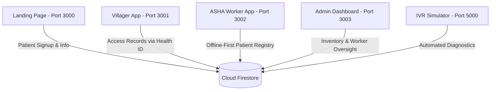

# 💖 GraamSehat (ग्राम सेहत)
> **Sleek, Premium, High-Fidelity Decentralized Rural Digital Healthcare Suite**

GraamSehat is a state-of-the-art digital healthcare ecosystem designed to bridge the gap in rural clinical healthcare delivery. The suite consists of **five tightly coupled micro-applications** integrated seamlessly via **real-time Firestore double-synchronization**, robust offline IndexedDB cache stores, interactive automated IVR diagnostic hubs, and modern, dynamic hybrid progressive Android wrappers.

---

## 🎨 Design Aesthetics & Color Architecture
The GraamSehat suite incorporates premium, high-fidelity design standards tailored for visual excellence and optimal accessibility:
*   **Harmonious Palette**: Unified using an elegant, modern **Teal Primary colorway (`#0d9488`)** to represent clinical health, cleanliness, and security.
*   **Premium Dark UI Accents**: Uses premium glassmorphic cards, harmonized HSL-tailored border hues, and sleek dark modes (`#0f172a`, `#1e293b`) for readability.
*   **Heart-Pulse Branding**: The entire system utilizes custom-designed medical EKG Heart-Pulse vector logo headers and favicons to establish a premium and professional brand identity.

---

## 🏗️ System Architecture & Sub-Applications



### 1. 🏥 Landing Page (Port `3000`)
*   Sleek modern marketing portal for GraamSehat.
*   Allows villagers to initiate pending registrations and complete fast SMS/OTP verifications.
*   Provides download cards for the standalone mobile applications.

### 2. 📱 Villager App (Port `3001` / APK Wrapper)
*   A premium, patient-centric PWA.
*   Villagers log in instantly using their Luhn-valid 6-digit Health IDs.
*   Visual dashboard shows recent clinical screenings, IDRS risk meter levels, and medicine prescription logs.

### 3. 👩‍⚕️ ASHA Worker Portal (Port `3002` / APK Wrapper)
*   An advanced, offline-first screening application.
*   Powered by Dexie (IndexedDB), enabling workers to register, screen, and distribute medicines to patients in remote areas with zero network connectivity.
*   **Registry Sync & Refresh**: Fully merges and pull-syncs new cloud patients down locally on command.

### 4. 📊 Admin Dashboard (Port `3003`)
*   The control tower of the ecosystem.
*   Real-time analytical graphs mapping regional clinical risk distributions.
*   Oversight on active ASHA Worker inventories, processing instant restocks, and auditing screenings.

### 5. 📞 IVR Diagnostic System (Port `5000`)
*   An automated tele-health console that simulates patient-doctor diagnostics.
*   Synchronizes tele-consultations directly with the Firestore patient timeline.

---

## ⚙️ Advanced Features

### 🔄 Vitals & Inventory Double-Sync
Screenings registered in the offline database double-write securely to both the patient's subcollection (`patients/{uid}/screenings`) and the global `screenings` collection in Firestore. Glucose metrics dynamically calculate overall clinical risk, immediately reflecting in the Admin dashboard. Inventory is updated using Firestore transactional updates.

### 🔐 Sandbox Bypass Mode
If the Google Firebase authentication servers are unreachable (offline testing), the Admin Dashboard dynamically activates a secure **Sandbox Bypass Mode**. Logging in with `admin.gs@graamsehat.org` and `password123` creates a beautiful local mock session, guaranteeing operational continuity in training or disconnected regions.

### 📱 Android Hybrid PWA APK Wrappers
Standalone wrapper apps reside inside the [APK](file:///c:/Users/ASUS/OneDrive/Documents/GraamSehat/APK) folder. They feature a premium Jetpack Compose native header with a **Settings Gear (`⚙️`)** enabling users to input custom dev IPs (like loopback `10.0.2.2` or local networks `192.168.x.x`) to dynamically load local or live hosted instances without recompilation!

---

## 🚀 Installation & Local Environment Setup

### Prerequisites
*   [Node.js](https://nodejs.org/) (v16+)
*   [npm](https://www.npmjs.com/)

### ⚡ Single-Command Dev Environment Launcher
We created robust launcher scripts in the root directory that automatically install dependencies in all five sub-applications, set up bindings, boot the dev servers sequentially, and automatically launch all 5 browser tabs:

#### For Command Prompt (Windows):
```cmd
run.bat
```

#### For PowerShell (Windows/Unix-compatible):
```powershell
.\run.ps1
```

*These scripts utilize native directory bindings (`/D`), preventingCMD quoting syntax crashes, and spin up persistent terminals on the following ports:*

*   `http://127.0.0.1:3000` — **Landing Page**
*   `http://127.0.0.1:3001` — **Villager App**
*   `http://127.0.0.1:3002` — **ASHA Worker App**
*   `http://127.0.0.1:3003` — **Admin Dashboard**
*   `http://127.0.0.1:5000` — **IVR Simulator Portal**

---

## 💾 Reseeding the Live Database
To reset testing environments, the Villager App includes an automated database cleanup and seeding routine:
1. Navigate to the Villager App folder:
   ```bash
   cd "Villager App"
   ```
2. Run the seeding tool:
   ```bash
   npm run seed
   ```
This will automatically wipe out mock values across 9 Firestore collections and populate the workspace with **25 Luhn-valid clinical patients** and default ASHA worker credentials (`asha1.gs@graamsehat.org`, `asha2.gs@graamsehat.org`, password `password123`).
